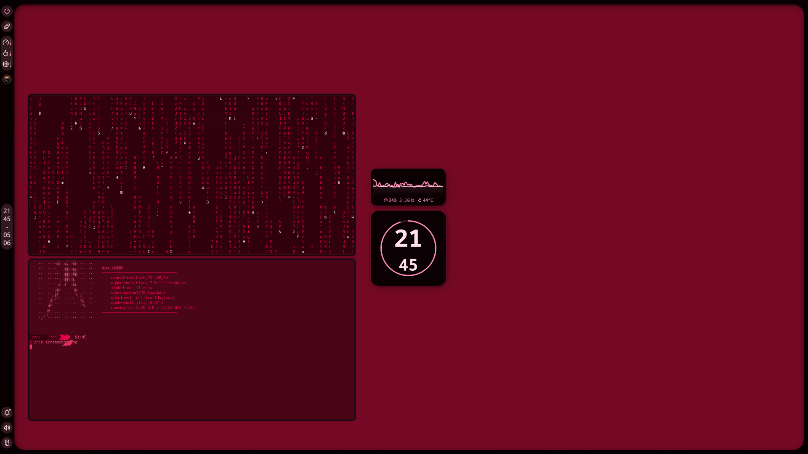

# Arch-Based DriftWM Desktop Environment Installer

This repository provides an automated installation script and pre-configured dotfiles for DriftWM coupled with the Noctalia Shell desktop environment on Arch Linux and its derivatives.

DriftWM is a trackpad-first infinite canvas Wayland compositor, and Noctalia Shell provides the essential desktop components including the status bar, panels, and notification daemon.

## Features

* Automated system update and package synchronization.
* Complete installation of DriftWM, Noctalia Shell, and required Wayland dependencies.
* Safe deployment of configuration files without overwriting existing unrelated data.
* Automatic shell migration to Fish with Starship prompt initialization.

## Pre-requisites

Before executing the installer, ensure that you have an active AUR helper installed. This script natively uses `yay` to handle both official repository packages and AUR packages.(start install.sh in TTY

## Installation

1. Clone this repository to your home directory:
   ```bash
   git clone https://github.com/3XmM/arch-based-driftwm-dots.git
   ```

2. Navigate into the repository directory:
   ```bash
   cd ~/arch-based-driftwm-dots
   ```

3. Make the installation script executable:
   ```bash
   chmod +x install.sh
   ```

4. Run the installer:
   ```bash
   ./install.sh
   ```

## Post-Installation

The script changes your default shell to Fish. To apply the shell changes completely throughout the system environment, please log out of your current session and log back in. 

To start the environment manually at any time, execute:
```bash
driftwm
```

## Screenshots



## License

This project is licensed under the MIT License. See the LICENSE file for details.
